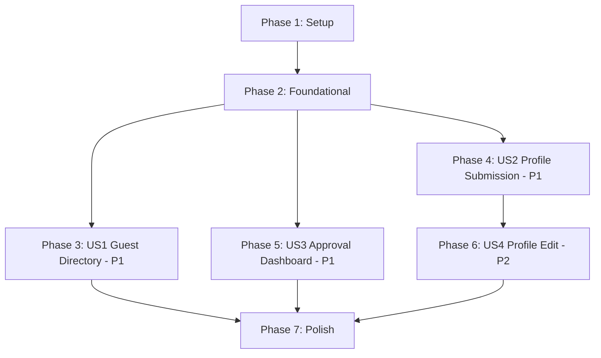

# Tasks: Portal User Scenarios — Foundation Phase Only

**Input**: Design documents from `/specs/002-portal-user-scenarios/`

**Prerequisites**: plan.md, spec.md, research.md, data-model.md, contracts/ (all loaded)

**Scope**: Phase 1 (Foundation) only — auth + roles, profile/skill schema, reusable approval dashboard. No Core Content, Community, Engagement, or Extras tasks.

**Organization**: Tasks are grouped by user story to enable independent implementation and testing of each story.

## Format: `[ID] [P?] [Story] Description`

- **[P]**: Can run in parallel (different files, no dependencies)
- **[Story]**: Which user story this task belongs to (US1–US4)
- Include exact file paths in descriptions

---

## Phase 1: Setup — Project Initialization

**Purpose**: Scaffold the Next.js project, install all dependencies, configure Tailwind/shadcn/ui with project design tokens.

- [X] T001 Initialize Next.js 15 project with TypeScript, App Router, `src/` directory at project root
- [X] T002 Install core dependencies: next-auth@5, drizzle-orm, @neondatabase/serverless, drizzle-kit, bcryptjs
- [X] T003 Install UI dependencies: tailwindcss, @tailwindcss/postcss, @radix-ui/* packages, lucide-react, class-variance-authority, clsx, tailwind-merge
- [X] T004 Initialize shadcn/ui with default components (button, card, input, label, dialog, badge, dropdown-menu, avatar, sheet, separator, select, textarea, toast) in `src/components/ui/`
- [X] T005 [P] Set up Neon database connection in `src/lib/db/index.ts` using `@neondatabase/serverless` HTTP driver
- [X] T006 Configure CSS custom properties in `src/app/globals.css` for light and dark modes matching color tokens from `docs/design-direction.md` (primary `#5B5FEF` light / `#8B8FFF` dark, secondary `#8B5CF6` / `#A78BFA`, status amber/green/red with low-opacity backgrounds)
- [X] T007 Create `src/styles/tags.css` with the neumorphic soft tag recipe from `docs/design-direction.md` §5 (border-radius 999px, low-opacity background, inset highlight shadow)
- [X] T008 Add `config/site.ts` with CURRENT_BATCH default value and site-wide constants

---

## Phase 2: Foundational — Blocking Prerequisites

**Purpose**: Core infrastructure that MUST be complete before ANY user story can be implemented. No user story work can begin until this phase is complete.

- [X] T009 Create Drizzle schema for `users` in `src/lib/db/schema/users.ts` — fields: id (uuid PK), email (text unique required), passwordHash (text nullable), authProvider (enum credentials|google|unclaimed), role (enum user|moderator|admin default user), createdAt, updatedAt
- [X] T010 Create Drizzle schema for `profiles` in `src/lib/db/schema/profiles.ts` — fields: id (uuid PK), userId (uuid FK→users.id unique), fullName (text required), studentId (text nullable unique when set), batchNumber (integer required), section (text required), avatarUrl (text nullable), bio (text nullable), facebookUrl (text nullable), linkedinUrl (text nullable), whatsappNumber (text nullable), portfolioUrl (text nullable), githubUrl (text nullable), isAlumni (boolean default false), currentCompany (text nullable), jobPosition (text nullable), status (enum pending|approved|rejected default pending), approvedBy (uuid FK→users.id nullable), approvedAt (timestamp nullable), createdAt, updatedAt
- [X] T011 Create Drizzle schema for `skills` in `src/lib/db/schema/skills.ts` — fields: id (uuid PK), name (text required), slug (text unique), parentSkillId (uuid FK→skills.id nullable), colorKey (text nullable)
- [X] T012 Create Drizzle schema for `profile_skills` join table in `src/lib/db/schema/profile-skills.ts` — fields: profileId (uuid FK→profiles.id), skillId (uuid FK→skills.id), composite PK
- [X] T013 [P] Create Drizzle schema for `notifications` in `src/lib/db/schema/notifications.ts` — fields: id (uuid PK), userId (uuid FK→users.id required), type (text required), title (text required), message (text nullable), resourceType (text nullable), resourceId (uuid nullable), read (boolean default false), createdAt (timestamp default now)
- [X] T014 [P] Run `drizzle-kit generate` and `drizzle-kit migrate` to push schemas to Neon
- [X] T014b Add search-performance indexes to Drizzle schema per `data-model.md` Index Strategy — GIN trgm index on `profiles(fullName)`, composite indexes on `profiles(batchNumber)` and `profiles(status, isAlumni)`; GIN tsvector on `questions(title, subject)` and composite on `questions(subject, course, batch, examType)`; applies to existing profiles and future questions schemas
- [X] T015 Implement Auth.js config in `src/lib/auth/auth.ts` — configure Credentials provider (verify email+passwordHash with bcrypt), Google provider, JWT strategy, extend JWT callback to inject role from `users.role`, extend session callback to pass role+id to client
- [X] T016 [P] Create `src/lib/auth/providers.ts` with Credentials and Google provider configs imported by auth.ts
- [X] T017 Implement Next.js middleware in `src/middleware.ts` — read JWT session, check role against route permissions map from `contracts/auth.md`, redirect unauthenticated users to `/login` for protected routes, return 403 for unauthorized role
- [X] T018 Create seed script in `src/lib/db/seed.ts` — insert admin user (email read from `ADMIN_SEED_EMAIL` env var or default, password read from `ADMIN_SEED_PASSWORD` env var), insert top-level skills (Web Development, ML/AI, Competitive Programming, Cybersecurity, Research, Design) with slugs and colorKeys
- [X] T019 Create permission utility in `src/lib/auth/permissions.ts` — `canApprove(userRole, resourceType)` returns boolean; moderators can approve `question`, `project`; only admins can approve `profile`. Note: alumni-flag changes are part of regular profile approval (admin-only) — no separate alumni approval path. Rationale: verifying alumni status/company claim is as trust-sensitive as verifying a new student profile. If alumni approval volume becomes a bottleneck later, split it into its own `canApprove` case then.
- [X] T020 Create `src/lib/utils.ts` with `cn()` (clsx+tailwind-merge), `formatDate()`, `capitalize()` helpers
- [X] T020b [P] Create `src/lib/search.ts` with shared Postgres full-text search helper — `buildSearchQuery(term, columns)` returning SQL for tsquery match; used by future question search. Note: the profile-role query (`searchProfiles`) was folded into `searchDirectory` in T021 so the guest-field SELECT lives in exactly one place

**Checkpoint**: Foundation ready — user story implementation can now begin.

---

## Phase 3: User Story 1 — Guest Browses the Directory (Priority: P1) 🎯 MVP

**Goal**: A visitor who hasn't logged in can search the Student Expert Directory and see approved profiles showing only fullName, batchNumber, and skill tags — no contact info.

**Independent Test**: Open the portal in a private browsing session (no login). Search by a skill name. Confirm result cards display only fullName, batchNumber, and skill tag names. Confirm whatsappNumber, facebookUrl, linkedinUrl, portfolioUrl, and githubUrl are absent.

### Implementation for US1

- [X] T021 [P] [US1] Create directory query helper in `src/lib/db/queries/directory.ts` — `searchDirectory(params: { query?, skillIds?, batchNumber? }, viewerRole): ProfileCard[]` — when viewerRole is `guest`, SELECT only profiles.id, profiles.fullName, profiles.batchNumber, join skills via profile_skills; when viewerRole is `user`/`moderator`/`admin`, SELECT full profile fields; always filter to `status = 'approved'`
- [X] T022 [US1] Create guest directory page at `src/app/(guest)/directory/page.tsx` — search bar + results grid using shadcn/ui components, calls `searchDirectory` Server Action, renders ProfileCard with guest-visible fields only
- [X] T023 [P] [US1] Create `ProfileCard` component in `src/components/directory/ProfileCard.tsx` — renders fullName, batchNumber, skill tags as neumorphic pills (using `src/styles/tags.css` recipe); when viewer is authenticated, also shows avatarUrl, section; conditionally shows isAlumni badge
- [X] T024 [P] [US1] Create `SkillTag` component in `src/components/directory/SkillTag.tsx` — renders a single skill pill with colorKey-based background from `src/styles/tags.css`
- [X] T025 [P] [US1] Create `EmptyState` component in `src/components/shared/EmptyState.tsx` — renders a centered message with optional icon and action button for modules with no content
- [X] T026 [US1] Create Navbar component in `src/components/layout/Navbar.tsx` — glassmorphism sticky navbar (using `docs/design-direction.md` §4 recipe: `rgba(255,255,255,0.55)` + `blur(16px)` + 1px border), logo, navigation links (Directory, Faculty, Questions, Clubs, Events, etc.), login button for guests, dark mode toggle via `next-themes`, user menu + bell icon placeholder for authenticated users
- [X] T027 [US1] Create root layout in `src/app/layout.tsx` — wraps children with `next-themes` ThemeProvider (light default, dark toggle), includes Navbar, imports `globals.css` and `tags.css`

**Checkpoint**: US1 fully functional — a guest can browse the directory and see only permitted profile fields.

---

## Phase 4: User Story 2 — Student Submits Profile (Priority: P1)

**Goal**: A logged-in student with no existing profile can fill out a profile form with all fields (fullName, studentId, batchNumber, section, social links, skills) and submit it. The profile enters `status = pending` and is not visible to anyone until an admin approves it.

**Independent Test**: Log in as a `user`-role student with no existing profile. Submit a completed profile with all optional fields filled. Log out and confirm the profile does not appear in guest search results. Log back in and confirm the profile shows `status = pending` with an amber badge.

### Implementation for US2

- [X] T028 [P] [US2] Create skills query helper in `src/lib/db/queries/skills.ts` — `getSkillsTree()` returns all skills grouped by parentSkillId (null = top-level), `getAllSkills()` returns flat list with id, name, slug, parentSkillId, colorKey
- [X] T029 [US2] Create the `upsertProfile` Server Action in `src/app/(user)/profile/actions.ts` — validates required fields (fullName, studentId, batchNumber, section), checks studentId uniqueness, sets `status = 'pending'`, inserts/updates profile_skills join records, returns `{ success, profileId, status }`
- [X] T030 [US2] Create the `getMyProfile` Server Action in `src/app/(user)/profile/actions.ts` — returns the current user's full profile data including linked skills, or null if none exists
- [X] T031 [US2] Create profile page layout and form at `src/app/(user)/profile/page.tsx` — if profile exists, show profile view page with full data and "Edit" button; if no profile, show creation form
- [X] T032 [US2] Build the profile creation/edit form component in `src/components/directory/ProfileForm.tsx` — fields: fullName, studentId, batchNumber (dynamic dropdown up to CURRENT_BATCH), section (fixed A–F dropdown), avatarUrl, bio, facebookUrl, linkedinUrl, whatsappNumber, portfolioUrl, githubUrl; skill multi-select using `getAllSkills()`; when isAlumni toggled, show currentCompany + jobPosition; submit calls upsertProfile
- [X] T033 [US2] Create `StatusBadge` component in `src/components/approval/StatusBadge.tsx` — renders amber/pending, green/approved, or red/rejected pill using the soft tag CSS from `docs/design-direction.md` §5 with status colors
- [X] T034 [US2] Create the "my submissions" page at `src/app/(user)/my-submissions/page.tsx` — shows the user's submitted profile with StatusBadge, link to edit
- [X] T035 [US2] Add login page at `src/app/(auth)/login/page.tsx` — email/password form with "Sign in with Google" button, calls Auth.js `signIn()`
- [X] T036 [US2] Add register page at `src/app/(auth)/register/page.tsx` — email, password, confirm password form; on submit creates user row in DB with `role = 'user'`, then signs in

**Checkpoint**: US2 fully functional — a logged-in student can create a profile, see it marked as pending, and it is hidden from public search.

---

## Phase 5: User Story 3 — Admin Approves Profile (Priority: P1)

**Goal**: An admin opens a unified approval dashboard, sees all pending profiles, reviews full profile data, and approves or rejects each one. Approved profiles become immediately visible. Rejected profiles notify the submitter with an optional reason.

**Independent Test**: Log in as an `admin`. Navigate to the approval dashboard. Approve a pending profile. Immediately open a guest session and search for that student's fullName — confirm the profile appears.

### Implementation for US3

- [ ] T037 [P] [US3] Create approval query helper in `src/lib/db/queries/approval.ts` — `getPendingItems(params: { resourceType?, page? })` returns paginated pending items with submitter name, timestamp, and full resource detail; `getPendingCounts()` returns counts per resource type; both functions accept viewer role and filter resource types accordingly (moderators don't see profiles)
- [ ] T038 [P] [US3] Create `approveItem` Server Action in `src/app/(admin)/approve/actions.ts` — validates caller is admin (or moderator for allowed types), updates status to `approved`, sets approvedBy + approvedAt, inserts notification row for submitter
- [ ] T039 [P] [US3] Create `rejectItem` Server Action in `src/app/(admin)/approve/actions.ts` — validates caller role, updates status to `rejected`, inserts notification row for submitter with optional reason
- [ ] T040 [US3] Create unified approval dashboard page at `src/app/(admin)/approve/page.tsx` — shows pending items grouped by resource type (profiles first), filter tabs, pagination; each item shows submitter name, submittedAt, resource type badge, and "Review" button
- [ ] T041 [US3] Create approval detail panel component in `src/components/approval/ApprovalCard.tsx` — shows full resource data (for profiles: fullName, studentId, batchNumber, section, avatarUrl, bio, social links, selected skills), "Approve" and "Reject" buttons; on reject, a textarea for the reason
- [ ] T042 [US3] Create moderator approval page at `src/app/(moderator)/approve/page.tsx` — same layout as admin approval but filtered to show only moderator-eligible resource types (not profiles)
- [ ] T043 [US3] Create notification query helpers in `src/lib/db/queries/notifications.ts` — `getUnreadCount(userId)`, `getRecentNotifications(userId, limit)`, `markAsRead(notificationId)`, `insertNotification(userId, type, title, message, resourceType, resourceId)`
- [ ] T044 [US3] Create notification bell component in `src/components/layout/NotificationBell.tsx` — renders bell icon with unread count badge, dropdown of recent notifications on click, click notification navigates to related page, auto-polls every 30s
- [ ] T045 [US3] Integrate notification bell into Navbar component — shows for authenticated users only (depends on T026 Navbar being complete)
- [ ] T045b Create notification API route at `src/app/api/notifications/route.ts` — `GET` returns unread count + recent notifications for current user, supports `?markRead={id}` param; used by T044 notification bell polling

**Checkpoint**: US3 fully functional — admin can approve/reject profiles and notifications are delivered.

---

## Phase 6: User Story 4 — Student Edits Approved Profile (Priority: P2)

**Goal**: A student whose profile is already approved can edit any field and resubmit. The profile reverts to `status = pending` and becomes hidden until an admin re-approves the changes.

**Independent Test**: Log in as a student with an approved profile. Edit the bio field and resubmit. Confirm the profile disappears from public directory search until re-approved.

### Implementation for US4

- [ ] T046 [US4] Update `upsertProfile` Server Action to handle edits on approved profiles — when an existing approved profile is edited with field changes, set `status = 'pending'`, clear `approvedBy` and `approvedAt`, keep existing profile ID, update all provided fields. **Note: core revert-to-pending logic (keep id, set pending, clear approvedBy/approvedAt) already implemented in T029's upsertProfile. Remaining scope is UI-only: Edit button + under-review banner, per T047.**
- [ ] T047 [US4] Update profile page at `src/app/(user)/profile/page.tsx` — when the profile is approved, show "Edit Profile" button that opens the ProfileForm pre-filled with current data; show "Your profile is under review" banner when status is pending
- [ ] T048 [US4] Add rate limit check to `upsertProfile` — enforce 1 profile edit per hour per user; return rate-limit error with `retryAfter` field when exceeded

**Checkpoint**: US4 fully functional — editing an approved profile re-enters the approval workflow.

---

## Phase 7: Polish & Cross-Cutting Concerns

**Purpose**: Improvements that affect multiple Foundation stories.

- [ ] T049 Create rate-limit helper in `src/lib/rate-limit.ts` — in-memory `Map<string, { count: number; resetAt: number }>`, `checkRateLimit(key: string, maxCount: number, windowMs: number)` returns `{ allowed: boolean; retryAfter?: number }`
- [ ] T050 Wire rate-limit helper into existing Server Actions (upsertProfile = 1/hour, all others = 5/hour) with user-based keys
- [ ] T051 Create `LoadingSkeleton` component in `src/components/shared/LoadingSkeleton.tsx` — renders placeholder shimmer for profile cards and directory list
- [ ] T052 Run `quickstart.md` scenarios 1 through 4 to validate all Foundation stories end-to-end
- [ ] T053 Verify guest SQL queries in `src/lib/db/queries/directory.ts` never return contact fields — inspect raw SQL for SELECT clause
- [ ] T054 Write a load test that confirms search latency stays under 2s for up to 5,000 profiles and 10,000 questions (SC-008 scale) — using Playwright or a simple script with EXPLAIN ANALYZE
- [ ] T055 [P] Configure Next.js revalidation for approval actions — after approveItem/rejectItem, call `revalidateTag('pending-items')` and `revalidateTag('directory')` so approved resources appear publicly within 5 seconds (SC-004)
- [ ] T056 Create admin settings page at `src/app/(admin)/manage/settings/page.tsx` with a form to update `CURRENT_BATCH`, saved to a `site_config` DB table or config; add `updateCurrentBatch` Server Action with admin-only access

---

## Dependencies & Execution Order

### Phase Dependencies



### User Story Dependencies

- **US1 (P1)**: Depends on Foundational (Phase 2) only. No dependency on other stories — can be implemented first.
- **US2 (P1)**: Depends on Foundational (Phase 2) only. No dependency on other stories — can parallel with US1.
- **US3 (P1)**: Depends on Foundational (Phase 2) only. Can parallel with US1 and US2. T045 depends on T026 (Navbar existing).
- **US4 (P2)**: Depends on US2 (profile creation must exist before editing). Must be implemented after US2.

### Within Each User Story

- Models/Schema before queries
- Queries before Server Actions
- Server Actions before page components
- Page components before shared components

---

## Parallel Opportunities

```bash
# Phase 1: All [P] tasks can run in parallel (T005)
Task T005: "Set up Neon DB connection in src/lib/db/index.ts"

# Phase 2: DB schema tasks (T009-T013) parallel, then migrations (T014) after
Task T009: "users schema in src/lib/db/schema/users.ts"
Task T010: "profiles schema in src/lib/db/schema/profiles.ts"
Task T011: "skills schema in src/lib/db/schema/skills.ts"
Task T012: "profile_skills schema in src/lib/db/schema/profile-skills.ts"
Task T013: "notifications schema in src/lib/db/schema/notifications.ts"
Task T016: "auth providers in src/lib/auth/providers.ts"

# US1 parallel: T021, T023, T024, T025
Task T021: "directory query helper in src/lib/db/queries/directory.ts"
Task T023: "ProfileCard component"
Task T024: "SkillTag component"
Task T025: "EmptyState component"

# US2 parallel: T028 (skills queries) before profile form, rest sequential
Task T028: "skills query helper in src/lib/db/queries/skills.ts"

# US3 parallel: T037, T038, T039, T043
Task T037: "approval query helper in src/lib/db/queries/approval.ts"
Task T038: "approveItem Server Action"
Task T039: "rejectItem Server Action"
Task T043: "notification query helpers in src/lib/db/queries/notifications.ts"

# All 3 P1 stories (US1, US2, US3) can be implemented in parallel by different developers
```

---

## Implementation Strategy

### MVP First (US1 Only)

1. Complete Phase 1: Setup → project ready
2. Complete Phase 2: Foundational → DB + auth + middleware ready
3. Complete Phase 3: US1 Guest Directory → guest can browse profiles
4. **STOP and VALIDATE**: Run `quickstart.md` Scenario 1
5. Deploy/demo: directory with seeded data is usable without login

### Incremental Delivery (Recommended)

1. Setup + Foundational → Foundation infrastructure ready
2. Add US1 (Guest Directory) → MVP — anyone can browse the directory
3. Add US2 (Profile Submission) → students can join the platform
4. Add US3 (Approval Dashboard) → admin/moderator workflow complete
5. Add US4 (Profile Edit) → students can update their profiles
6. Polish → rate limits, dark mode, skeletons, load test, validation

**Each story adds value independently and can be tested/deployed immediately.**
